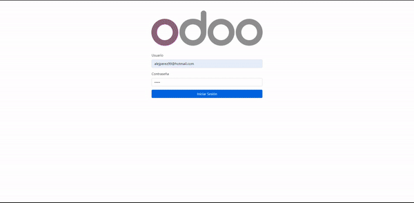

# Angular Odoo

[](http://www.gnu.org/licenses/lgpl-3.0-standalone.html)

Esta aplicación web esta desarrollada con Angular, trata de integrar operaciones del software de planificación de recursos empresariales [Odoo](https://github.com/odoo/odoo). Esto se realiza utilizando la API que nos ofrece el módulo de [graphql_odoo](https://github.com/alelasesino/graphql_odoo) creado para este proyecto.

## Visión General

La aplicación permite gestionar el inventario del Odoo, para ello se pueden visualizar las recepciones de inventario que se ha realizado de un determinado origen. Ademas de permitir registrar nuevas recepciones de inventario, seleccionando los productos existentes en Odoo.

## Uso

Ejecuta el comando `npm start` para levantar un servidor de desarrollo. Dirígite a `http://localhost:4200/`. La aplicación se reiniciara automáticamente si se realiza algún cambio en los archivos fuente.

### Configuración Proxy

Será necesario cambiar las propiedades `target` hacia la IP del servidor donde se encuentra alojado Odoo en el fichero `proxy.conf.json`.

```json
{
    "/graphql": {
        "target": "http://server-ip:8069",
        "secure": false,
        "changeOrigin": true
    },

    "/web/session/authenticate": {
        "target": "http://server-ip:8069",
        "secure": false,
        "changeOrigin": true
    }
}
```

Para comenzar a trabajar con esta aplicación, es recomendable tener conocimiento de los siguientes conceptos

- Aprenda los [conceptos básicos de Angular](https://angular.io/docs)
- Tener conocimientos básico en el manejo de Odoo
- Entender el funcionamiento de [Apollo-Client](https://www.apollographql.com/docs/)

## Vista previa

> Navegación por la aplicación web.

<p align="center">
  
</p>

## Créditos

Este módulo ha sido creado como parte del proyecto de final de grado por Alejandro Pérez Álvarez.

Para cualquier consulta, contacta con <alejperez99@hotmail.com>.
